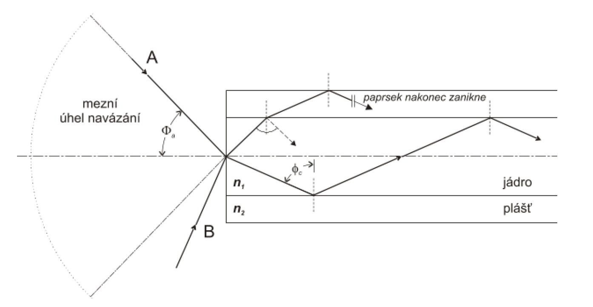
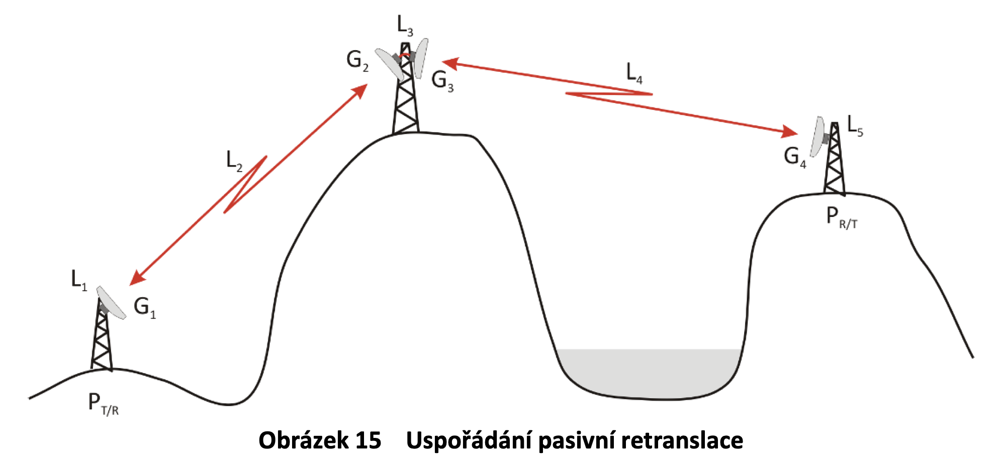
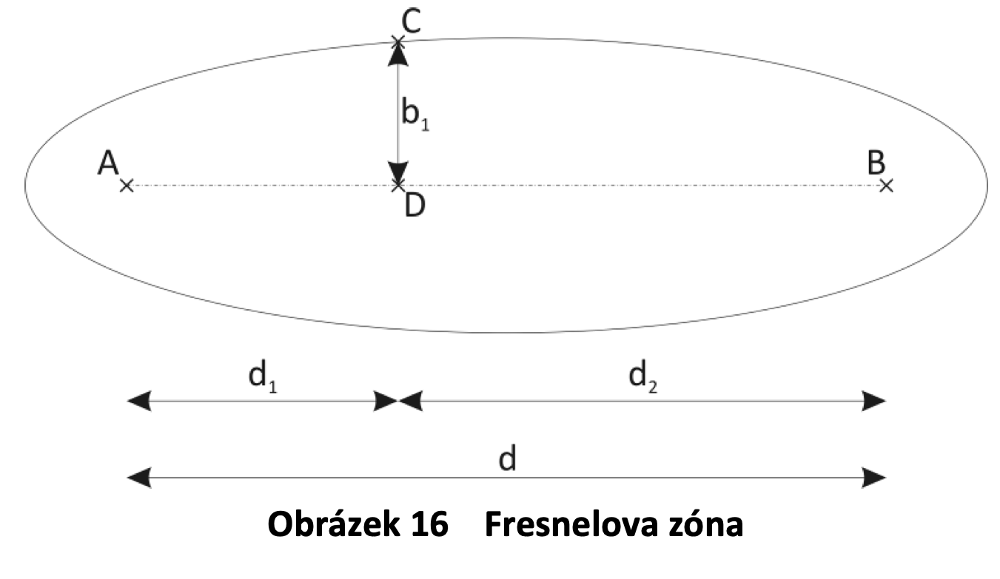

# 1. Elektromagnetické pole, hlavní vlastnosti

 
# 2. Sdělovací metalická vedení, primární parametry
# 3. Sekundární parametry metalického vedení
# 4. Odrazy na vedení, Smithův diagram
# 5. Optická vlákna – druhy a jejich vlastnosti

optické vlákno je skleněné vlákno složené z více vrstev skla. toto vlákno se používá na přenos světla na velké vzdálenosti.

<br>


numerická apertura ?

disperze
vidová
chromatická
polaruzační


## Jednovidová vlákna


## Mnohovidová vlákna
# 6. Konstrukce a pokládka optických kabelů, výroba optických vláken
# 7. Měření parametrů optických vláken
# 8. Bezdrátový přenos signálu – energetická bilance


## Modulace

### Spojité
### Diskrétní


### spojité - analogová
U = A *sin (t * \omega + \pí)

#### jednoduché

##### AM

- DSB
- SSB
  - USB
  - LSB


##### FM

##### PM

#### složené

##### QAM

**modulátor**

```
A ---> |X| ---
        |      \
      |π/2|     \
        |        \
Ω ----->         |+| ---> A, φ
        |        /
        |       /
        |      /
B ---> |X| ---
```

**demodulátor**

```
A, φ ---> |X| ---> |\ A/2|  ---> A/2
           |     
         |π/2|   
           |        
Ω -------->       
           |        
           |       
           |      
A, φ ---> |X| ---> |\ B/2| ---> B/2
```

### diskrétní - analogová


### spojité - digitální

##### QAM

**modulátor**

```
A ---> |X| ---
        |      \
      |π/2|     \
        |        \
Ω ----->         |+| ---> A, φ
        |        /
        |       /
        |      /
B ---> |X| ---
```

**demodulátor**

```
A, φ ---> |X| ---> |\ A/2|  ---> A/2
           |     
         |π/2|   
           |        
Ω -------->       
           |        
           |       
           |      
A, φ ---> |X| ---> |\ B/2| ---> B/2

```

### diskrétní - digitální
# 9. Antény a jejich parametry
# 10. Pozemské spoje bod-bod

Spoj bod-bod je obousměrné bezdrátové propojení dvou bodů úzkým paprskem.
Provozují se na frekvencích od 100 MHz do 300 GHz, jak v licenčních, tak i v bezlicenčních pásmech. 

Tyto spoje se často používají na propojení vzdálených stanic, které jsou mimo infrastrukturu.

<br>

## Modulace
  - 2, 4-PSK
  - 256, 512, 1024-QAM 


## Výkonová bilance


 výkon vysílače [dBm]

 zisk vysílací antény [dBi]

 zisk vysílací antény [dBi]

 celkové stálé ztráty [dB]

 celkové náhodné ztráty [dB]

ztráty volným prostorem (Free Space Loss)

### Fresnelova zóna
Prostor, ve kterém se šíří 60 % energie vysílané mezi body v **první** Fresnelově zóně.

Vypadá jako párek.

^{\frac{1}{2}}) 

<br>

### Útlum
#### Šířením volným prostorem 
  Tento útlum záleží na frekvenci a vzdálenosti. Vychází z Maxwellových rovnic.
  
  +20log(f[Ghz]))
#### Hydrometeory
  Je útlum způsobený počasím - silný déšt, mlha a sněžení.

  Tento útlum se odvíjí od podnebí, ve kterém se nachází spoj.

#### Rychlý únik
  Vícevidové šíření. Signály jsou posunuté díky odrazům a nelinearitě atmosféry.
# 11. Signály a jejich spektrum, kapacita přenosového kanálu
# 12. Modulace spojitými signály
# 13. Modulace diskrétními signály
# 14. Model telekomunikačního řetězce
## Teorie informace
    Informace -> Zpráva -> Signál
### Informace
- je nehmotná
- můžu určit její množství
- informaci dokážu přenášet (v prostoru x, y, z, t)
- maximální rychlost C (ve vakuu), přenáším informaci v čase a prostoru
- užitečné (informace jen o změně)
- nadbytečné (redundantní), (o ustáleném stavu, opakující se)
### Zpráva
- zhmotněná informace (třeba si něco zapíšu do sešitu)
- fyzikální podstata (akustické vlnění, el. proud, chemické vazby, optika…)
- abeceda :                   
  - diskrétní = digitálně skrz A/D převodník
  - spojitá = mluvení do mikrofonu
- kódování (gramatika, pravidla)
### Signál 
- zpráva, která se hodí k určitému přenosu
- přechod z jednoho signálu na druhý:
  - změna abecedy
  - změna fyzikální podstaty
  - změna kódování
### Redundance
- Poměr užitečných informací vůči neužitečným
  - \- Zabírá místo			
  - \- Zvyšuje cenu
  - \+ Zvyšuje odolnost proti chybám
  
  
## Model telekomunikačního řetězce
co se zprávou musíme udělat, než ji pošleme po kanálu

    zdroj --> kodér zdroje --> kodér kanálu --> Kanál --> dekodér kanálu --> dekodér zdroje --> příjemce

### Kanál
- spojuje dvě místa
- přenáší signál
- drát, trubka, vzduch, optické vlákno…
- výhoda: spojuje dva body
- nevýhody: je drahý, dělá chyby, neumí přenést vše, omezená kapacita
- chyby: rušení a zkreslení
### Kodér zdroje 
(komprese)
- má za úkol signál zkrátit (snižuje redundanci)
- zrychluje a zlevňuje komunikaci
- př.: .zip, .rar, MPEG (.mpg, .mp3, .mp4)
### Kodér kanálu
- má za úkol signál přizpůsobit parametrům kanálu tak, aby dobře prošel
- zajištuje, aby signál prošel kanálem nezměněný
- př.: RS-232, I²C, Ethernet II
### Mnohonásobný přenos kanálem
- **xDM**	(Division Multiplex)
- **xDMA**	(Division Multiple Access)
  - **SDMA**	(Space Division Multiple Access)
    - Rozdělení prostoru na různé oblasti
  - **FDMA**	(Frequency Division Multiple Access)
    - Rozdělení spektra na části (kanály)
  - **WDMA**	(Wave lenght Division Multiple Access)
    - Rozdělení spektra na části (kanály)
  - **TDMA**	(Time Division Multiple Access)
    - Nejpoužívanější
  - **CDMA**	(Code Division Multiple Access)
    - Pomocí kódování zprávy
    
    
## Komprese
### Ztrátová komprese
- nahradí nejméně potřebná data podobnými daty, která už jsou ve zprávě obsažena, ale ve větší váze -> ztratí část informace
- obrázek = snížení počtu barev, hudba = snížení vzorkovací frekvence
- příklad:
  - **jpg**
  - **mp3**
  
### Bezeztrátová komprese
- místo, aby věci opakovala, tak je jen popíše
- neztratí data, pouze je upraví, aby byla kratší
- příklad:
  - **rle**
  - **zip**
  - **rar**
  
### RLE
**RLE** je bezeztrátová komprese a má široké využití.  
Komprimuje tak, že kóduje posloupnosti stejných hodnot do dvojic (délka posloupnosti, hodnota). 

    AAAACDDCBBBBBCDABBDBCCCC --RLE--> 4AC2DC5BCDA2BDB4C

### JPEG
**JPEG** je ztrátová komprese používaná na obrázky.  

- Postup komprimace: 
  1. obrázek převedu do **YCbCr**
  2. Snížení přesnosti informací o barvě (blok: barva 16x16, jas 8x8)
  3. Složky obrázku jsou následně rozděleny do bloků a na každém bloku je provedena diskrétní transformace
  4. Provede se kvantizace (zde dochází ke ztrátové kompresi)
  5. Zkomprimuje se pomocí bezeztrátové komprese **RLE** a použije se **Hufffmanovo kódování**
  
  

### MPEG 
MPEG je *Moving Picture Experts Group* komprese pro video a audio.  
- druh: 
  - **MPEG4** (video, DVB2)
  - **MPEG3** (nepoužívá se, byla zrušena)
  - **MPEG2** (DVD, DVB)
  - **MPEG1** (zvuk ,CD)
  
#### MPEG2
- Postup komprimace: 
  1. Stream se rozdělí do group, ty obsahují 12 framů.  
  Typy framů:
    - **I** - obrázek  .jpg
    - **P** - předvídání
    - **B** - bidirectional 
  2. Framům se přisadí tip  
  v pořadí:
          I B B P B B P B B P B B
    
  
  
  
  
  
# 15. Síťové technologie


## Historie 
Model OSI vznikal tehdy, kdy se data posílala po telefonních kanálech.


## Členění modelu OSI 

### Horizontální dělení
Dělení na systémy  
Dva typy
- koncové systémy   (PC)
- mezilehlé systémy [občas se mohou chovat jako koncové systémy] (switch, router)

### Vertikální dělení
Dělení na vrstvy


#### Větičky
7\. **Aplikační vrstva** &nbsp;&nbsp;&nbsp;&nbsp;&nbsp;&nbsp; --> &nbsp; Vzájemnou komunikaci aplikací.  
6\. **Prezentační vrstva** &nbsp; --> &nbsp; Správná prezentace dat na koncovém systému.  
5\. **Relační vrstva** &nbsp;&nbsp;&nbsp;&nbsp;&nbsp;&nbsp;&nbsp;&nbsp;&nbsp; --> &nbsp; Stará se o zahájení, průběh a ukončení jednotlivých relací.  
4\. **Transportní vrstva** &nbsp; --> &nbsp; Transport dat s předem definovanými vlastnostmi.  
3\. **Síťová vrstva** &nbsp;&nbsp;&nbsp;&nbsp;&nbsp;&nbsp;&nbsp;&nbsp;&nbsp;&nbsp; --> &nbsp; Zajišťuje přenos mezi libovolnými systémy, nejdůležitější.  
2\. **Linková vrstva** &nbsp;&nbsp;&nbsp;&nbsp;&nbsp;&nbsp;&nbsp; --> &nbsp; Spolehlivý přenos mezi sousedními systémy.  
1\. **Fyzická vrstva** &nbsp;&nbsp;&nbsp;&nbsp;&nbsp;&nbsp;&nbsp;&nbsp; --> &nbsp; Přenos jednotlivých bitů a synchronizace.

## Tok data modelem  

### Enkapsulace a dekapsulace
N = číslo vrstvy
```
N + 1|            |PDU|                 |
-----|------------|---|-----------------|
N    |       {|PCI|SDU|PCI|} = PDU      |
-----|--------|-----------|-------------|
N - 1|   {|PCI|    SDU    |PCI|} = PDU  |
```
# 16. Referenční model OSI
## ISO/OSI
Referenční model **ISO/OSI** (Open Standart for Interconnection) se používá jako názorný příklad řešení komunikace v počítačových a telekomunikačních sítích pomocí vrstevnatého modelu, kde jsou jednotlivé vrstvy nezávislé a snadno nahraditelné.

### Pravidla OSI modelu
- Žádnou vrstvu nesmím vynechat
- Vrstvu mohu rozdělit do podvrstev

## Model OSI

|ČÍSLO|VRSTVA|JEDNOTKA DAT|POPIS|
|---|---|---|---|
|7\.|**Aplikační vrstva**|data|komunikace aplikací|
|6\.|**Prezentační vrstva**|data|má na starosti kódování zprávy
|5\.|**Relační vrstva**|data|má na starosti navázání, udržení a ukončení spojení|
|4\.|**Transportní vrstva**|segment|spojuje příjemce s odesílatelem|
|3\.|**Síťová vrstva**|paket|stará se o správný přenos po síti a spojuje uzly|
|2\.|**Linková vrstva**|rámec|vrstva starající se o bezchybný přenos na médiu|
|1\.|**Fyzická vrstva**|bity|spojení mezi dvěma body|

## Vrstvy od Šerýcha (Větičky) 

7\. **Aplikační vrstva** &nbsp;&nbsp;&nbsp;&nbsp;&nbsp;&nbsp; --> &nbsp; Vzájemnou komunikaci aplikací.  
6\. **Prezentační vrstva** &nbsp; --> &nbsp; Správná prezentace dat na koncovém systému.  
5\. **Relační vrstva** &nbsp;&nbsp;&nbsp;&nbsp;&nbsp;&nbsp;&nbsp;&nbsp;&nbsp; --> &nbsp; Stará se o zahájení, průběh a ukončení jednotlivých relací.  
4\. **Transportní vrstva** &nbsp; --> &nbsp; Transport dat s předem definovanými vlastnostmi.  
3\. **Síťová vrstva** &nbsp;&nbsp;&nbsp;&nbsp;&nbsp;&nbsp;&nbsp;&nbsp;&nbsp;&nbsp; --> &nbsp; Zajišťuje přenos mezi libovolnými systémy, nejdůležitější.  
2\. **Linková vrstva** &nbsp;&nbsp;&nbsp;&nbsp;&nbsp;&nbsp;&nbsp; --> &nbsp; Spolehlivý přenos mezi sousedními systémy.  
1\. **Fyzická vrstva** &nbsp;&nbsp;&nbsp;&nbsp;&nbsp;&nbsp;&nbsp;&nbsp; --> &nbsp; Přenos jednotlivých bitů a synchronizace.
# 17. TCP/IP protocol stack


## Vrstvový model TCP/IP
|ČÍSLO|VRSTVA|JEDNOTKA DAT|PROTOKOLY|POPIS|
|---|---|---|---|---|
|7\.|**Aplikační vrstva**|data|HTTP, FTP, SSH, MQTT|komunikace aplikací|
|4\.|**Transportní vrstva**|segment|TCP, UDP|spojuje příjemce s odesílatelem|
|3\.|**Síťová vrstva**|paket|IP4/IP6, ICMP, IGMP|stará se o správný přenos po síti a spojuje uzly| 
|2\.|**Linková vrstva**|rámec|Ethernet, ARP|vrstva starající se o bezchybný přenos na médiu|
|1\.|**Fyzická vrstva**|bity|UTP kabel, Optické vlákno, WIFI|spojení mezi dvěma body|


### Navazování spojení HTTP
|n.|protokol|odesílatel|příjemce|zpráva|odpověď|
|---|---|---|---|---|---|
|1. | ARP | Apple_d1:12:b1    |Broadcast     |Who has 192.168.1.1 Tell 192.168.1.180| |
|2. | ARP | Routerbo_24:dd:ae |Apple_d1:12:b1|192.168.1.254 is at 64:d1:54:24:dd:ae|2.|
|3. | DNS | 192.168.1.180     |192.168.1.51  |Standard query 0xea2a A korona.panska.cz| | 
|4. | DNS | 192.168.1.51      |192.168.1.180 |Standard query response 0xea2a A korona.panska.cz A 217.195.162.33|3.|  
|5. | ARP | Apple_d1:12:b1    |Broadcast     |Who has 192.168.1.254 Tell 192.168.1.180| |
|6. | ARP | Routerbo_24:dd:ae |Apple_d1:12:b1|192.168.1.254 is at 64:d1:54:24:dd:ae|5.| 
|7. | TCP | 217.195.162.33    |217.195.162.33|64986 -> 80 [SYN]| |
|8. | TCP | 217.195.162.33    |192.168.1.180 |80 -> 64986 [SYN, ACK]|5.|
|9. | TCP | 92.168.1.180      |217.195.162.33|64986 -> 80 [ACK]|6.|
|10. | HTTP| 192.168.1.180     |217.195.162.33|GET / HTTP/1.1| |
|11. | TCP | 217.195.162.33    |192.168.1.180 |80 -> 64986 [ACK]|8.|
|12.| HTTP| 217.195.162.33    |192.168.1.180 |HTTP/1.1 200 OK (text/html)|8.|
|13.| TCP | 192.168.1.180     |217.195.162.33|64986 → 80 [ACK]|10.|
 
 
# 18. Linková vrstva a ethernet

## Ethernet
- Síťová technologie (LAN)
- Nejrozšířenější síťová technologie
- Zabírá první a druhou vrstvu OSI
### Ethernet I
- Topologie: BUS (sběrnice)
- Rychlost: 10Mbps
- Kabel: Koaxiální kabel s impedancí 50 Ω (max 500 m kabelu)
- Vznikl v letech  1972–1975 v laboratořích PARC firmy Xerox
### Ethernet II a IEEE 802.3 
- Topologie: Star
- Rychlost: 100 Mbps, 1 Gbps, 10 Gbps
- Kabel: UTP kabel (CAT 5, CAT 5e, CAT 6 a CAT 7) (max 100 m kabelu)


## Typy zpráv
### Unicast
### Multicast
### Broadcast


## Linková vrstva

### MAC adresa

Ethernetová MAC adresa se skládá ze 48 bitů, např.: (01:23:45:67:89:ab).
MAC adresa se nemění a je svázaná s konkrétní síťovou kartou

### Rámec

- Ethernet II Rámec:
|Preambule|         | cílová mac adresa     | zdrojová mac adresa |EtherType|data          |CRC          |  
|:-------:|:-------:|:--:|:----------------:|:-------------------:|:-------:|:------------:|:-----------:|  
|         |         | 80 00 20 7A 3F 3E     | 80 00 20 20 3A AE   | 08 00   | payload      | 00 20 20 3A | 
|7 bytů   | 1 bytů  | 6 bytů                | 6 bytů              |2 bytů   |46 - 1500 bytů|4 bytů       |  
  
## ARP protokol 


## VLAN
# 19. Síťová vrstvaa IP adresace
## IP adresa
V4
verze
masky


V6
zkrácení

multikást

speciální adresi :  ::1/128 - loopback 
                    FE80::/12 - 

maska = prefix

## Paket
# 20. Transportní vrstva
## TCP protokol
## UDP protokol
# 21. Aplikační vrstva
# 22. Bezpečnost v sítích
# 23. Switch

 
<br>
**L2 Switch**


<br>
**L3 Switch** 


## Switchovací tabulka
## VLAN
# 24. Router

<br>
**Router** 

## Roubovací tabulka
# 25. Bezdrátové síťové technologie
