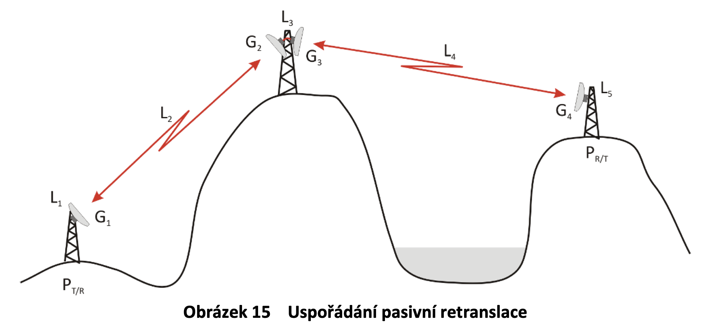
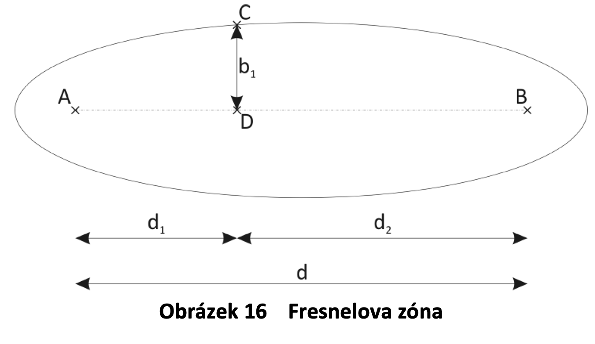

# 10. Pozemské spoje bod-bod

Spoj bod-bod je obousměrné bezdrátové propojení dvou bodů úzkým paprskem.
Provozují se na frekvencích od 100 MHz do 300 GHz, jak v licenčních, tak i v bezlicenčních pásmech. 

Tyto spoje se často používají na propojení vzdálených stanic, které jsou mimo infrastrukturu.

 

## Modulace
  - 2, 4-PSK
  - 256, 512, 1024-QAM 

## Výkonová bilance

 výkon vysílače [dBm]

 zisk vysílací antény [dBi]

 zisk přijímací antény [dBi]

 celkové stálé ztráty [dB]

 celkové náhodné ztráty [dB]

ztráty volným prostorem (Free Space Loss)

### Fresnelova zóna
Prostor, ve kterém se šíří 60 % energie vysílané mezi body v **první** Fresnelově zóně.

Vypadá jako párek.

^{\frac{1}{2}}) 

 

### Útlum
#### Šířením volným prostorem 
  Tento útlum záleží na frekvenci a vzdálenosti. Vychází z Maxwellových rovnic.
  
  +20log(f[Ghz]))
#### Hydrometeory
  Je útlum způsobený počasím - silný déšt, mlha a sněžení.

  Tento útlum se odvíjí od podnebí, ve kterém se nachází spoj.

#### Rychlý únik
  Vícevidové šíření. Signály jsou posunuté díky odrazům a nelinearitě atmosféry.
