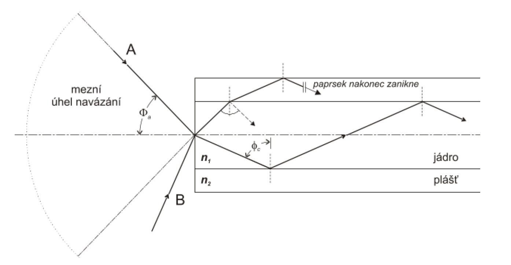

# 5. Optická vlákna – druhy a jejich vlastnosti

optické vlákno je skleněné vlákno složené z více vrstev skla. toto vlákno se používá na přenos světla na velké vzdálenosti.

 

numerická apertura ?

disperze
vidová
chromatická
polaruzační

## Jednovidová vlákna

## Mnohovidová vlákna
