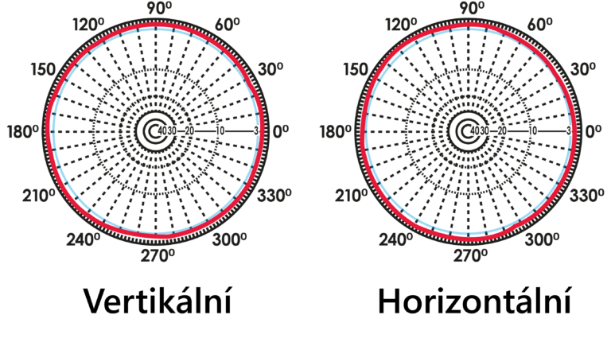
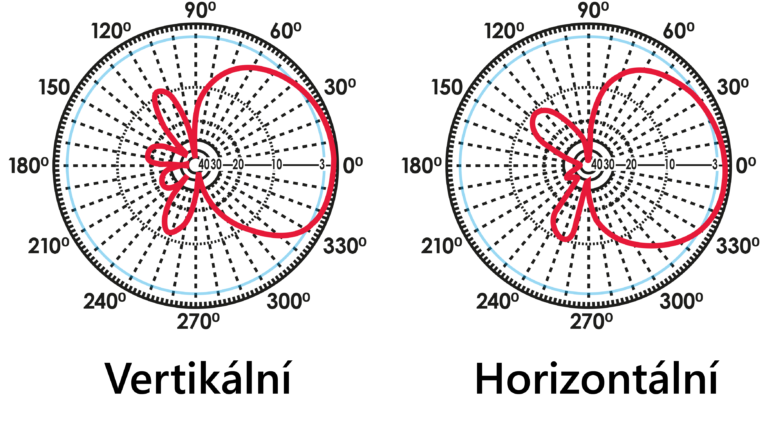
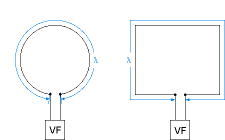
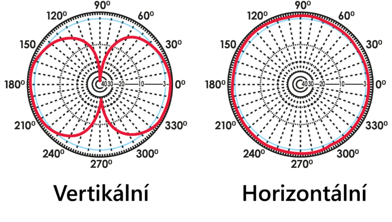
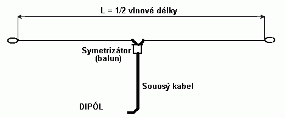
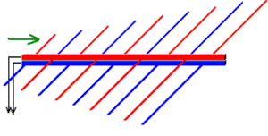
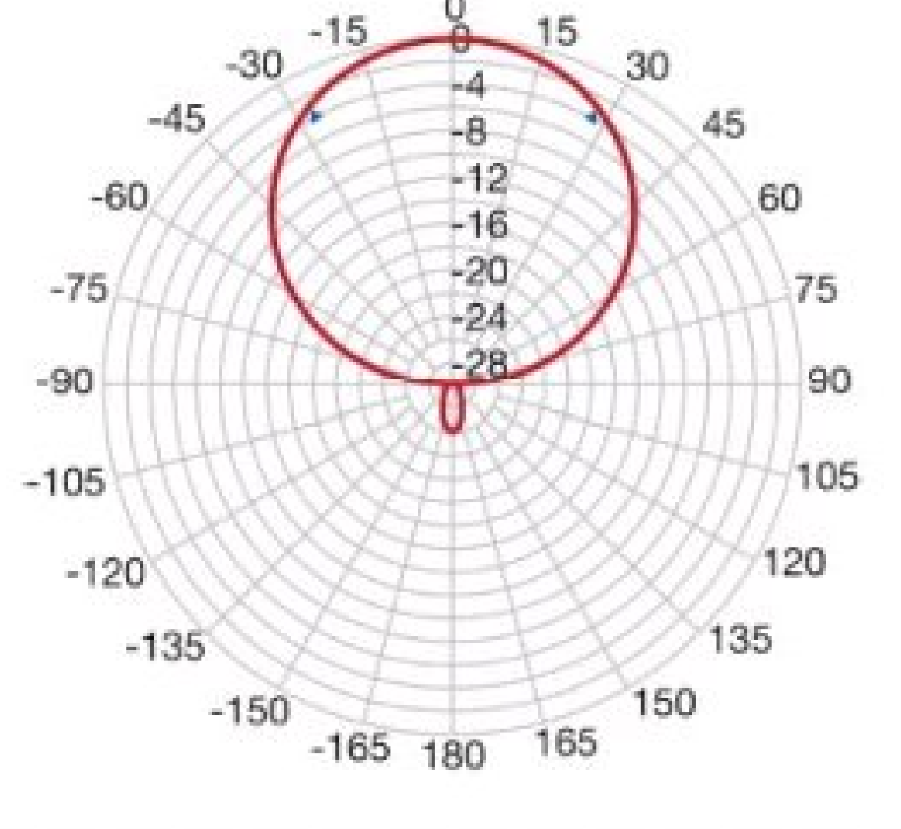
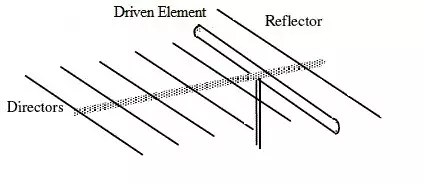
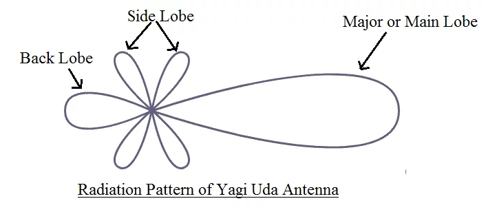
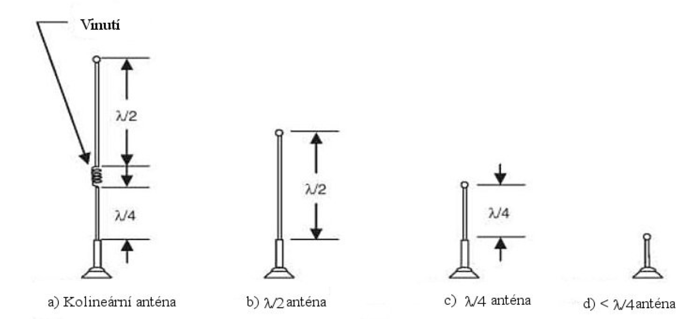

# 9. Antény a jejich parametry
**Anténa** je zařízení, které převádí elektromagnetický signál z kabelu do volného prostoru a naopak

## Dělení
### Podle účelu
- #### Přijímací
  - je určená pro přijímání 
  - musí mít nízký šum
  - většinou je směrová
  
- #### Vysílací
  - je určená k vysílání
  - musí snést vysoké výkony
  - často je všesměrová
  

### Podle vyzařovací charakteristiky
- #### Všesměrové
  - do všech směrů vysílá stejný výkon
  - ideální všesměrový vysílač -> izotropní zářič
  
 
- #### Směrové
  - veškerý výkon je směrován do jednoho směru
  - ideální směrový vysílač vysílá pouze jeden lalok (paprsek)
  
 

### Podle přijímaných frekvencí
- #### Úzkopásmové
  - přijímají pouze jednu frekvenci
  - chovají se jako filtry
- #### Širokopásmové
  - mohou přijímat různé frekvence najednou

### Podle konstrukce
- #### Smyčková anténa
  - první typ antény, který byl vymyšlen
  - používá se max. do 100 kHz
  - tvořena smyčkou z drátů
  - chová se jako cívka
  - vyzařovací diagram vyzařuje ve tvaru toroidu
  

 

- #### Dipólová anténa
  - tvořena dvěma vodiči, které jsou naproti sobě a každý z nich je dlouhý 1/4 vlnové délky přijímaného signálu
  - vzdálenost vodičů tvoří imperanci antény
  - vyzařovací diagram ve tvaru toroidu
  - používá se nad 100 kHz

 

- #### Logaritmicko-periodická anténa
  - kombinace půlvlných dipólů -> jsou zařazeny za sebou a laděny na různé frekvence
  - dipól před naladěným dipólem pro něj tvoří deflektor a dipól za ním tvořím reflektor
  - vysoce směrová
  - je širokopásmová
  - má jeden velký paprsek a jeden sekundární v opačném směru
  - používá se nad 100 kHz
  

 

- #### Yagi–Uda anténa
  - speciální varianta logaritmo-periodické antény
  - vysoce směrová
  - tvořena pouze jedním dipólem a několika rezonančními deflektory a reflektory
  - má jeden hlavní paprsek, čtyři boční a jeden vedlejší vzadu
  - používá se nad 100 kHz
  

 

- #### Prutová anténa
  - varianta půlvlného dipólu s jedním uzemněným prutem
  - používá se na pohybující se věci nebo na dlouhé vlny
  - používá se nad 100 kHz
   

 

- #### Parabolická anténa
  - vyzařovací diagram vypadá jako paprsek
  - má postranní laloky
  - tvořena odraznou plochou a samotným přijímačem

- #### Anténa s postupnou vlnou

- ### MAIMO
