# 1. Telefonní přístroj – princip, druhy

## Co to je telefonní přístroj, k čemu to slouží 
Telefon je komunikační přístroj který přenáší zvuk mezi dvěma pevnými body.


## zvuk a jeho vlastnosti 
(kmitočet, úroveň hlasitosti, lidská řeč)

## elektroakustické měniče
převodníky elektrického signálu na zvukové vlnění a obráceně
### mikrofon
- uhlíkový mikrofon
- dynamický mikrofon
- kondenzatorový mikrofon

### sluchátko

## telefonní přístroj MB (LB)
schéma

protimístné zapojení

## telefonní přístroj AUT 
schéma

číselnice


### signalizace u klasického telefonu AUT – přenašeč typu U 

#### pulzní volba

#### tónová volba

napětí
proudy
volba


## ochrana vedení proti rušení 
symetrické vedení

## komunikace telefonu s ústřednou 


## další telefony
### ISDN 

### VoIP 
# 2. Pobočková technika

co to je, k čemu to slouží  

důvod zavedené PBů 

## terminologie
- pobočka
- státní linka
- svazek  


## funkce Pobočkové ústředny
### služby:  
- přepojení
- přesměrování 
- zpětné vyzvonění
- konference
- napojení do hovoru  

### odchozí státní styk:  
- oprávnění účastníků
- číslovací plán telefonní sítě a jeho souvislost s oprávněními
- volba operátora 10xx
- GSM brána,
- ARS - LCR ( u 2N: šetřící automat )  

### příchozí státní styk:
- volání na spojovatelku 
- provolba DID
- provolba DISA
- povinnost pobočky 11 – 11111 

## tipy Pobočníkových ústředen:
- analogové
- digitální ústředny
- VoIP – Asterisk    

# 3. Digitalizace telefonního signálu

Digitalizace telefonního signálu je převod analogového signálu na digitální a na spět.

Výhodou je jednoduší zpracování signálu a nižší zkreslení.


## Převodníky


### vzorkování

#### Shannonův–Nyquistův–Kotělnikovův teorém
vzorkovací kmitočet pro telefonní hovor


### kvantování
#### kvantizační zkreslení


### kodování
#### nelineární kvantování 
(lin a potom se to neli zkomprimuje)
- A zákon
- µ zákon

## PCM

**TDM**
 


parametry lidské řeči, kmitočtový rozsah, úroveň signálu  

Shannon-Kotělnikův teorém , vzorkovací kmitočet pro telefonní hovor 

vzorkování, kvantování, kódování, kvantizační zkreslení   

PCM  
# 4. Digitální spojování – články T a S

co to je, k čemu to slouží 

PCM – E1 

způsob spojování účastníků v digitální telefonii  

pole T a jeho konstrukce, pole řízené ze vstupu a z výstupu 

pole S a jeho konstrukce, pole řízené ze vstupu a z výstupu 

větší spojovací pole  - TS, ST 

vnitřní blokování 

bezeztrátová spojovací pole  - TST, STS  

ústředny EWSD a S12  
# 5. Signalizace ve spojovacích sítích

**Signalizace** (v telefonních sítích) je proces ke sestavení a ukončení telefonního hovoru

typy signalazice 
CAS - stejný kanál jako hovor
CCS - zvlášsní kanál

##stavi Signalizace

1. klid - klid
2. obsazení (vizvedneme telefon)
3. volba (natuáme číslo)
4. vizvánení
5. hovor - klid
6. ukončení hovoru


## Přenašeč tipu U
typ CAS
analogová Signalizace
### stavi 
klid - 48V, 0A
obsazení - stejnosměrný proud pokles V, teče 2OmA
volba - tónová nebo pulzní(pulzi 100 ms)
vyzvánění - střídavé napětí 50Hz/25Hz 75V
vyzvednutí - stejnosměrný proud pokles V, teče 2OmA 
ukončení hovoru - 48V, 0A

## Signalizace DSS1 
typ CAS 
digitální Signalizace
DSS1 používá se na ISDN rozhraní.
### ISDN
zdroj
http://www.elearn.vsb.cz/archivcd/FEI/ISDN/isdn_text.pdf
#### vrstvi 
1. fizická - AMI
2. linková - HDLC
3. Sítová - DSS1

### stavba packetu

Protocol discriminator

### stavi 
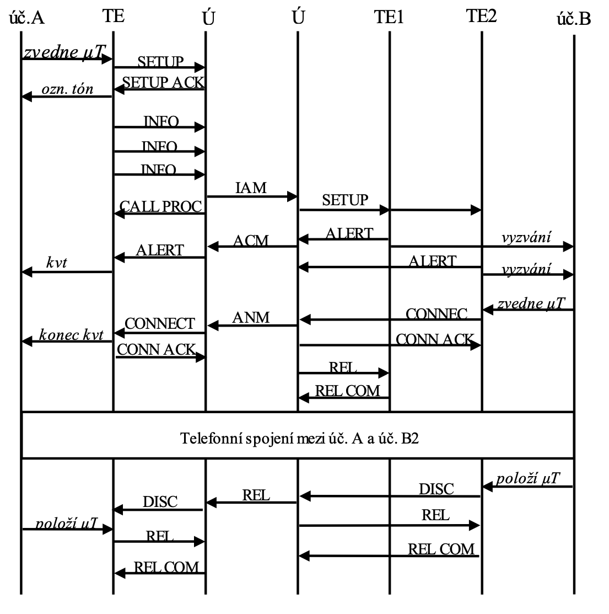<br>


## Signalizace SS7
typ CCS
digitální Signalizace

### dělení sítí
- NAT 0 - provider
- NAT 1 - stát
- INAT 0 - mezistátní (evropa, usa)
- INAT 1 - mezikontinettální (země)

### typi ustředen
- SP
- STP 

zdroj
http://ozeas.sdb.cz/panska/3A/TS/vyuka/SS7/adoc.pub_signalizani-system-ss7.pdf


kubalík 


co to je, k čemu to slouží 

základní stavy signalizace ( klid, obsazení, volba, závěr, ......) 

přenašeč typu U 

signalizace DSS1 

signalizace SS7  

porovnání s modelem OSI 

popis signalizační sítě, úrovně, SP, STP  

MTP, TUP, ISUP, SCCP  vrstvi

popis průběhu signalizace při spojení účastníků   
# 6. Přípojky ISDN

co to je, k čemu to slouží 

důvod zavedení ISDN a naděje s ním spojené 

přípojka 2B+D  

referenční model 

protokol na fyzické vrstvě 

protokol v D kanálu linkové vrstvy  

řešení kolizí v D kanálu 

protokol na 3. vrstvě – signalizace DSS1 
# 7. Přenosové systémy PCM, PDH a SDH

co to je, k čemu to slouží 

PCM prvního řádu – E1  

PCM druhého a vyšších řádů  

sdružování nižších řádů do vyššího 

stuffing  

popis rámce PDH  

důvod zavedení SDH 

rámec SDH – STMx 

popis trasy SDH ( path, multiplexer section, regenerator section ) 

popis rámce STM1 a jeho návaznost na strukturu trasy 

virtuální kontejner 

vkládání příspěvků 
# 8. Legislativní podmínky provozu bezdrátových spojů

Vysvětlete, za jakých podmínek je možný provoz vysílacího radiového zařízení.

Vysvětlete pojem „Národní kmitočtová tabulka“.

Kčemu opravňuje takzvané „všeobecné oprávnění“ (dříve generální licence) a za jakých podmínek?Uveďte některé příklady všeobecných oprávnění.

Co jsou takzvané občanské radiostanice? Kdo je může používat?

Jak jsou stanovovány technické podmínky kprovozu vysílačů a proč?

Co serozumí pojmem homologace vysílacího zařízení. Jaká je územní platnost homologací?

Jaké zkoušky se provádí vrámci homologačního řízení? Jaké dokumenty si musí obstarat provozovatel profesionální radiové sítě? 

Které orgány je vydávají?Kdo vypracovává takzvaný „Návrh radiové sítě“ a jaké informace musí obsahovat?
# 9. Komponenty bezdrátových systémů

Vysvětlete dělení elektronických řetězců podle charakteru a kmitočtu zpracovávaného signálu.

Srovnejte pojmy úzkopásmový a širopásmový zesilovač. Pro jaké signály se tyto zesilovače používají?

Popište, jaké druhy vazby se používají mezi jednotlivými stupni řetězce. Jaké mají výhody a nevýhody? Nakreslete schemata vazebních obvodů.

Vysvětlete, jak pracuje vysokofrekvenční zesilovač ve třídě C. Jaké má charakteristické vlastnosti?
# 10. Přijímače – superhet a SDR

## Superhet

```
                 ^
                /
    ant. --> filtr --> směšovač --> filtr --> zesilovač --> detektor --> nz. frekvence
              /           ^  
                          |/
                         ozs 
                         /
                         
                         
                         
```                    


## SDR 

převedu signál na na nižší frekvenci pomocí superhetu 

### Přijímač

#### DDC

**ant.**
<font color="red">--></font>
**BPF** 
<font color="red">--></font> 
**ADC** 
<font color="green">--></font> 
**DDC** 
<font color="green">--></font>
**CPU** 
<font color="green">--></font> 
**signal**

- BPF - filtr pro základní pásmo
- ADC - A/D převodník
- DDC - digitální směšovač (snižuje frekvenci nosné, posunuje ji o 90° a snižuje vzorkovací frekvenci)
- CPU - signálový procesor

**DCC**  
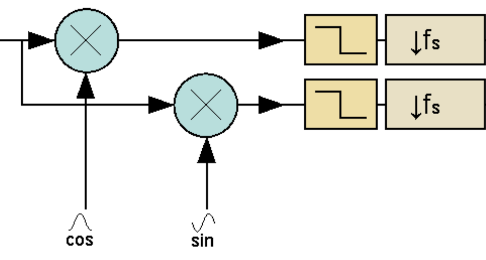<br>


#### QSD

**ant.**
<font color="red">--></font> 
**BPF** 
<font color="red">--></font> 
**QSD** 
<font color="red">--></font> 
**ADC** 
<font color="green">--></font> 
**CPU** 
<font color="green">--></font> 
**signal**


- BPF - filtr pro základní pásmo
- QSD - analogový směšovač (snižuje frekvenci nosné, posunuje ji o 90° a snižuje vzorkovací frekvenci)
- ADC - A/D převodník
- CPU - signálový procesor
 
 
### Vysílač

                      I | \
                   / -> |  >
                  /     | /
        cpu => D/A   
                  \   Q |
                   \ -> |
                        |
# 11. Architektura mobilních sítí (GSM, GPRS, LTE)
<!-- 
## Architektura mobilních sítí

### Zkratky
  - RAN (Radio Access Network) -
  - UE (User Equipmen) - uživatelský terminál (mobilní telefon)
  - BTS (Base transceiver station) - základnové stanice

### typy síť

#### trunková síť -->


#### Celulární síť
Celulární síť je metoda pokrytí oblasti signálem.
Oblast je rozdělena do podobě velkých částí které se nazývají **buňky** (cell). Většinou mají tvar šestiúhelníků. V bunkách se opakují stejné frekvence ale ne ve dvodvou sousedních. Svazkem se nazívají bunky s rozdílnou frekvencí. Svazky můžeme skládat libovolně vedle sebe aniž by došlo k rušení.

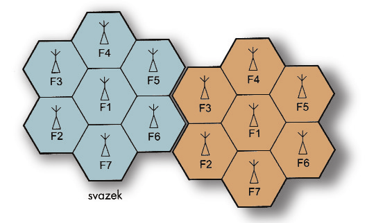<br>


<!-- ## síť s přepojováním okruhů (CS)
## síť s pepínání paketů (PS)

Vysvětlete, jak jsou tvořeny kmitočtové plánypro celulární sítě. Vkolika sektorech zpravidlapracuje jedna základnová stanice?
 -->


## G0
### AMR 
**Automatizovaný Městský Radiotelefon**

AMR byla Celulární síť s přepojováními okruhy, s analogovou signalizací a s analogovým přenosem hlasu.
AMR nepodporovala mobilitu, museli jste vědět kde se uživatel nachází.


## G1
### NMT
**Nordic Mobile Telephone**

NMT byla Celulární síť s přepojováními okruhy, s digitální signalizací s analogovým přenosem hlasu.

Přístup byl vázán na konkrétní stanici, SIM negzistovala.


## G2
### GSM
**Global System for Mobile Communications**

GSM je Celulární síť s přepojováními okruhy, s digitální signalizací s digitální přenosem hlasu.

Uživatelská práva jsou vázány na SIM.

    G2      
    BTS (Base transceiver station) = základnové stanice
    BSC (Base Station Controller) = řídící stanice 
    UE (User Equipmen) = uživatelský terminál (mobilní telefon)
    MSC () = ustředna 

#### Přístupové metody
Přístupové metody v GSM jsou **FDAM** a **TDAM**.
FDAM jsou oddělené jednotlivé BTS ve svazku (Celulární síť). TDAM jsou uděleny jednotlivé time sloty pro komunikaci s UE. Každá frekvence je rozděla na 8 time slotů, přičemž je jeden vyhrazen signalizaci.

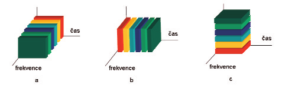<br>
**A - FDAM, B - TDMA, C - CDMA**

#### Pásma
      1. 900 MHz
      2. 1800 MHz

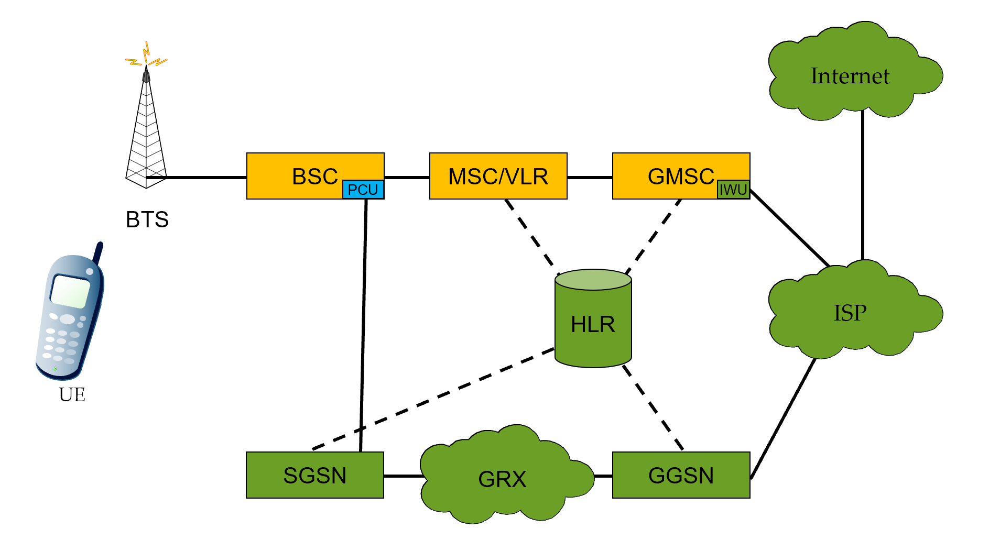<br>


### G2.5
#### GSM s GPRS
GPRS přenášet data pomocí technologie přepínání paketů (PS). Hlas se stále přenáší pomocí přepojováním okruhů (CS). 

### G2.75
#### GSM s EGPRS
EGPRS došlo k zvýšení rychlosti přenosu dat. Díky změně modulace. 

## G3
### UMTS

**Universal Mobile Telecommunications System**

UMTS je Celulární síť s přepojováními okruhy, s digitální signalizací, s digitální přenosem hlasu a data se přepínání paketů.

    G3      G2
    NodeB = BTS
    RNC   = BSC
    
#### Přístupové metody
Přístupové metody v UMTS jsou **FDAM** a **CDMA**.
FDAM jsou oddělené jednotlivé NodeB ve svazku (Celulární síť). CDMA jsou oddělené jednotlivé UE.

#### Pásma
      1. 1,2 GHz
      
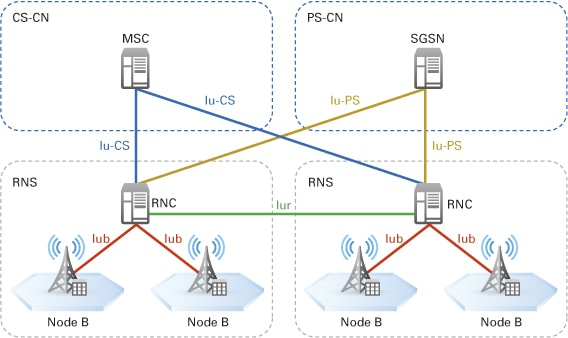<br>


## G4
### LTE
**Long-Term Evolution**

LTE je Celulární síť s přepínání paketů, s digitální signalizací a s digitální přenosem hlasu.

    G4      G2
    eNB  = BTS
    eNB  = BSC


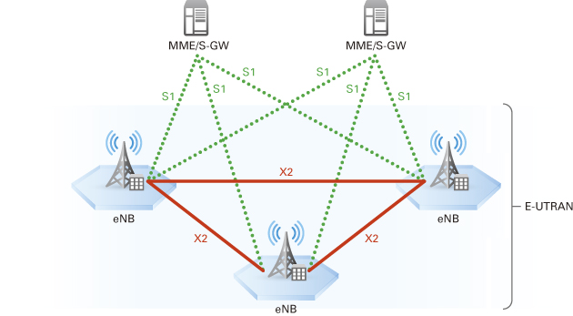<br>

## G5


mimo
# 12. Družicové systémy

Družice je umělí satelit planety 

## oběžné dráhy

### GPS


Vysvětlete pojem geostacionární telekomunikační satelit.Jaké systémy jsou potřeba pro jeho provoz? Jakémá základní parametry

Jaký je dosah satelitní komunikace na zemi. Čím je dosah satelitu určen?

Co jsou a jak se používají systémy VSAT?

probíhat obousměrná komunikace přes satelit ve srovnání skomunikací pozemskými prostředky?

Popište rozdíl mezi družicemi geostacionárními, meostacionárními a nízkooběžnými.Pro jaké systémy jsou vhodné nízkooběžné družice a proč?

Popište stručně koncepci a funkci systému GPS.

Zjakých segmentů se systém skládá?

Jak se určuje poloha přijímače?

Co to je takzvaná diferenciální GPS?
# 13. Zdrojové kódování systému DVB
# 14. DVB–S, C kanálové kódování
# 15. DVB–T kanálové kódování
# 16. DAB/DAB+
# 17. Zdroje světla pro telekomunikační systémy

Zdroje světla slouží k tomu aby vyslali signál po optickém vláknu.

## parametry
- vlnová délka λ v optické komunikaci se používají tito (850 nm , 1310 nm a 1550 nm)
- víkon P  0 dB = 1 mW

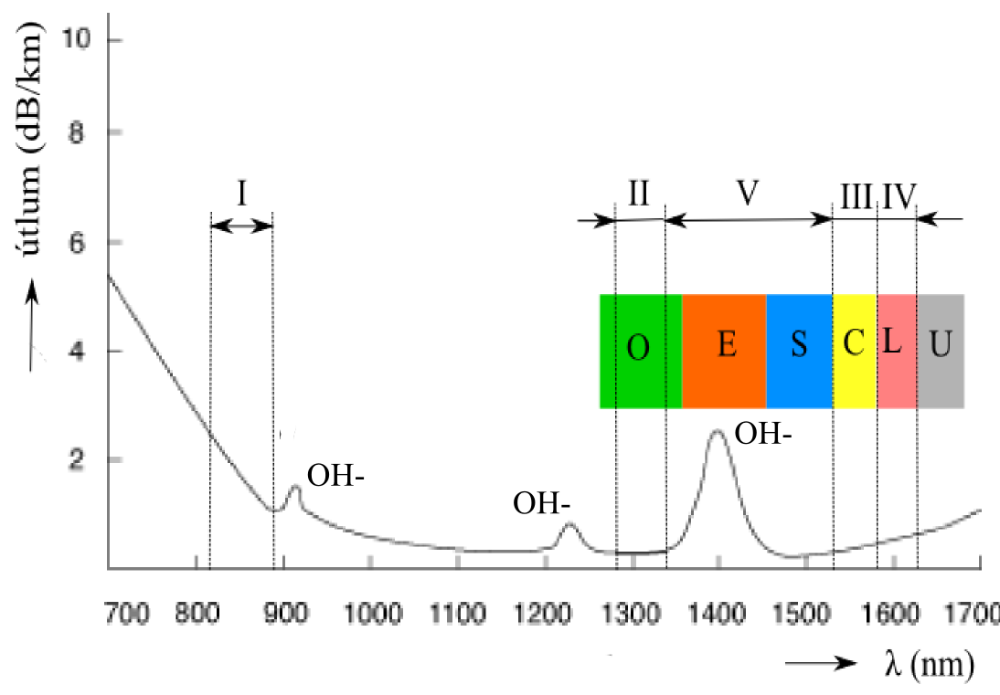<br>


základní parametry používaného světla ( λ, P, spektrální charakteristika, .... ) a jejich zdůvodnění vzhledem k parametrům vláken 

## Zdroje světla
### LED 

### polovodičový Laser 

#### pásmový model laseru


emise, absorpce, stimulovaná emise, koherentní záření , energie fotonu 

čerpání, vyprázdněná oblast 

Fabri – Perotův rezonátor 

struktura LD (laserová dioda) 

Braggova mřížka 

dosažitelné parametry laserů 
# 18. Detektory světla pro telekomunikační systémy

co to je, k čemu to slouží 

vnitřní fotoelektrický jev 

pásmový model polovodiče a diody 

energie fotonu 

absorpce a emise fotonu 

červená mez ( dlouhovlnná mez ) 

PIN dioda   

lavinová dioda  

parametry  fotodiod  
# 19. Optické systémy WDM

co to je, k čemu to slouží 

grid WDM, coarse a dense WDM 

požadavky na zdroje a detektory světla pro WDM 

čtyřvlnné směšování ( FWM ) a důvody jeho vzniku 

odstranění FWM – vlákna NZD  

ROADM (reconfigurable optical add-drop multiplexer ) 

EDFA a jejich možnosti   
# 20. Modulační techniky a protokoly optických sítí

co to je, k čemu to slouží 

možnosti modulace ( co se dá modulovat) 

nároky na modulaci ( na co musíme dát pozor, aby to fungovalo) 

přímá a nepřímá modulace 

nevýhody přímé modulace 

Elektro-Absorpční Modulátor (EAM) 

Mach-Zehnderův Modulátor (MZM) 

používané modulační kódy a protokoly  (NRZ, RZ, CSRZ, CRZ, SSB, VSB, ... ) 

oko rozhodnutí a jeho konstrukce 

koherentní modulace 

porovnání s možnostmi radiových signálů ( Shannonova věta ) 
# 21. Páteřní optické sítě

co to je, k čemu to slouží 

topologie  

technologie ( DWDM, .... ) 

použití EDFA a ROADM   

příklady sítí  ( Cesnet, Telematica, UPC, DialTelecom, ... NIX ) 

podmořské kabely 

měření a dohled nad sítí  
# 22. Přístupové optické sítě – druhy a principy funkce
Všechno kromě páteřní sítě 

## PON
pasive optical network

### P2P
komunikace bod -> bod  
používá se například pro firmy

      
    provider <------------> user


### P2MP
komunikace bod -> moc bodů  
požívá se pro technologii FTTH

                                    / <--> user
                  TDM              /  <--> user
    provider <------------> splitter
                                   \  <--> user
                                    \ <--> user
                                    
### GPON
ITU

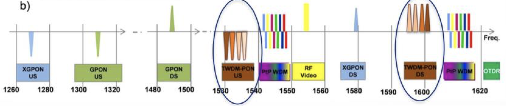
<br>

### EPON
IEEE

                                      users
                               / <--> ONU/ONT
    provider                  /  <--> ONU/ONT
    OLT <------------> splitter
                              \  <--> ONU/ONT
                               \ <--> ONU/ONT
### Typy PON 
#### GPON
  - GPON - 2.5GB/1.252.5GB
  - NGPON1 - 10GB/2.5GB
  - NGPON2 - 40GB/10GB
  - XGS-EPON  - 10GB
  
#### EPON
  - 1G-EPON - 1GB
  - 10G-EPON - 10GB
  
  
# kubalik

co to je, k čemu to slouží 

názvosloví 

PON 

P2P, P2MP  

FTTx - FTTH, FTTB, FTT....  

GPON – protokoly, koexistence s jinými systémy, spojení mezi OLT a ONT  

EPON 

útlumový plán, třídy útlumu 
  
  
# 23. Komponenty pro optické přístupové sítě


## Vlákna

## Sváry
### Svár
<br>
<br>

### Svářečka
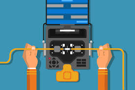<br>
<br>

### Svařování

1. na vlákno nasadíme ochranu sváru.  
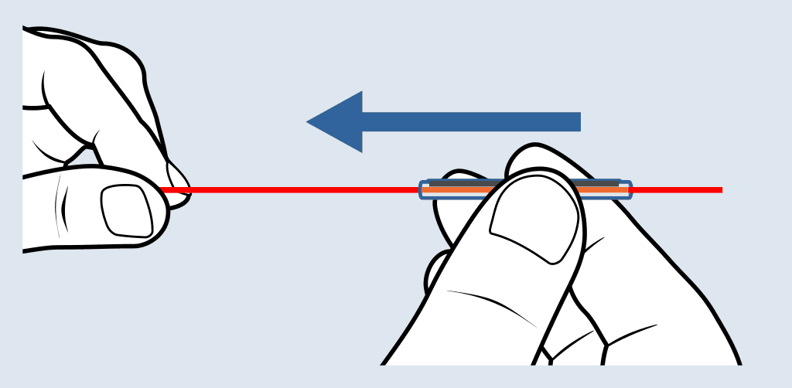<br>


2. pomocí kleští sundáme primární ochranu.   
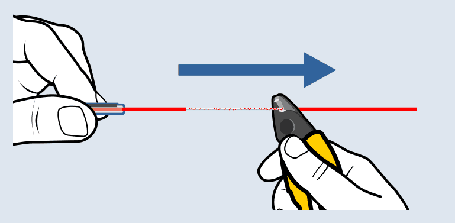<br>


1. očistíme hadříkem namočeným do izopropil alkoholu.  
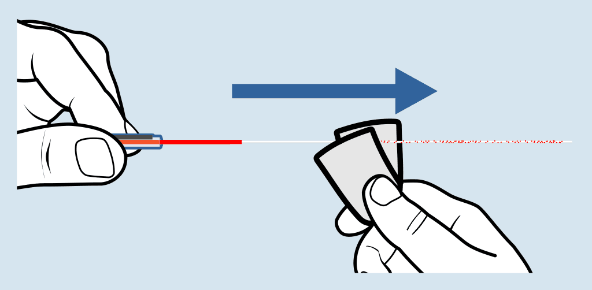<br>

4. ulomíme konec vlákna na lámačce.  
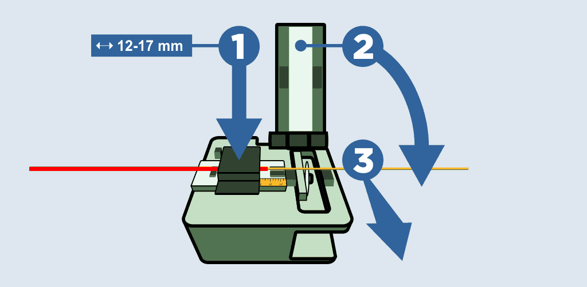<br>

5. vlákna upneme do svářečky, po zaklapnutí se automaticky svaří.  
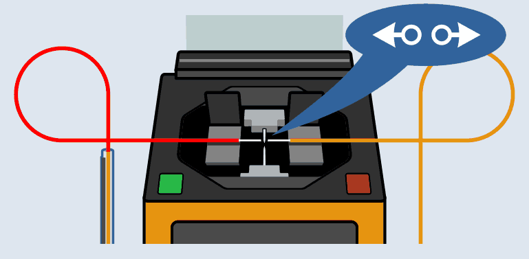<br>

1. na svár přemístíme ochranu a zapečeme.  
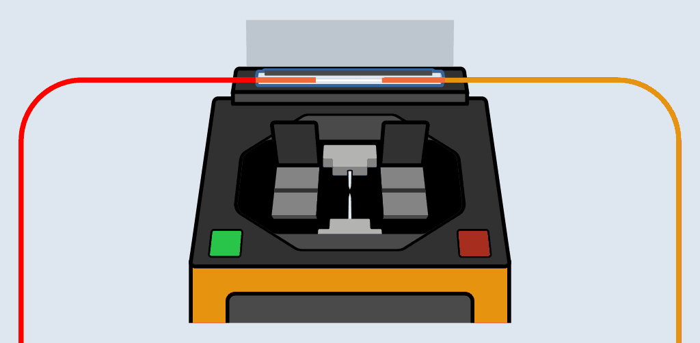<br>


1. opatrně zatáhneme za čerstvý svár, pokud se neroztrhne je v pořádku.  
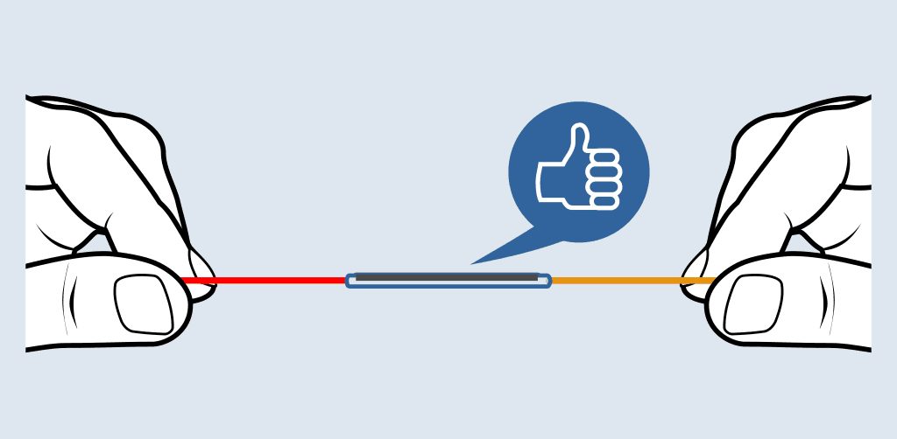<br>


## Konektory

Konektor na spojování optických vláken tvoří keramická ferule, ve které je uchyceno skleněné vlákno. Ta je uchycena do plastového pouzdra, které zajištuje její rovnání vůči feruli na druhé straně.

### PC ferule

Konektor s označením **PC** je většinou <font color="blue">**modrý**</font>, ale může mít i jinou jakoukoli barvu.
Ferule je plochá.

<br>
<br>

### APC ferule
Konektor s označením **APC** je vždy <font color="green">**zelený**</font> a takřka nikdy nemá jinou barvu.
Ferule je zkosená, aby deflektovala odražené světlo.  
<font color="red">**!!!**</font>
<font color="green">**Zelený**</font>
konektor se může zapojovat jen do
<font color="green">**zeleného**</font>
konektoru, jinak se zničí
<span style="color:red">**!!!**</font>

<br>
<br>

### Typy konektorů
#### SC konektor
**SC** konektor je nepoužívanějším typem konektoru.  
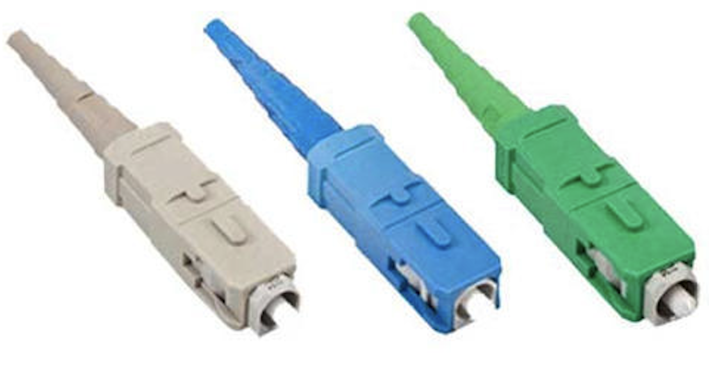
<br>
<br>
<br>

#### LC konektor
**LC** konektor se většinou používá na zásuvných kartách v routrech a switčích.  
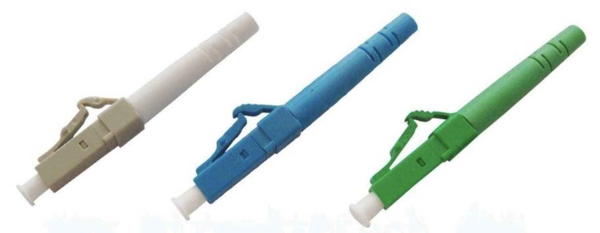
<br>
<br>
<br>

#### E2000 konektor   
**E2000** konektor se využívá na dálkových trasách díky jeho vysoké spolehlivosti.   
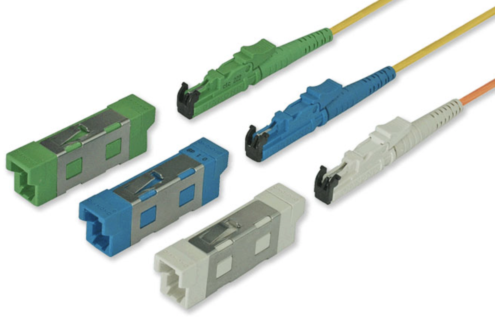<br>

## Spojky

## Splitry

## Zesilovače

# Kubalik

OLT,  ONT  

vlákna  pro vnější vedení ,  pro vnitřní instalace 

kabely   - do kabelovodu , do země,   závěsné,   domovní - riser kabel  

kabelovody ,  trubičky,  mikrotrubičky,  zafukování  

konektory  - PC,APC, útlum, útlum odrazu , reflektogram  

splittery   - výpočet útlumu  

rozvaděče , cable management v rozvaděči  

účastnické zásuvky 

měření sítě pomocí OTDR   
# 24. Optika v datových centrech

požadavky na datové přenosy v dat. centrech - rychlost, vzdálenost, objem dat  

porovnání vlastností SM a MM vláken  

porovnání ceny komponentů  

používané systémy 

dosahované výsledky  
# 25. Sítě NGA a NGN

co to je, k čemu to slouží 

názvosloví 

požadavky na sítě NGA, NGN ( rychlost, agregace, ..... ) 

použitelné technologie 

strategie Digitální Česko 
