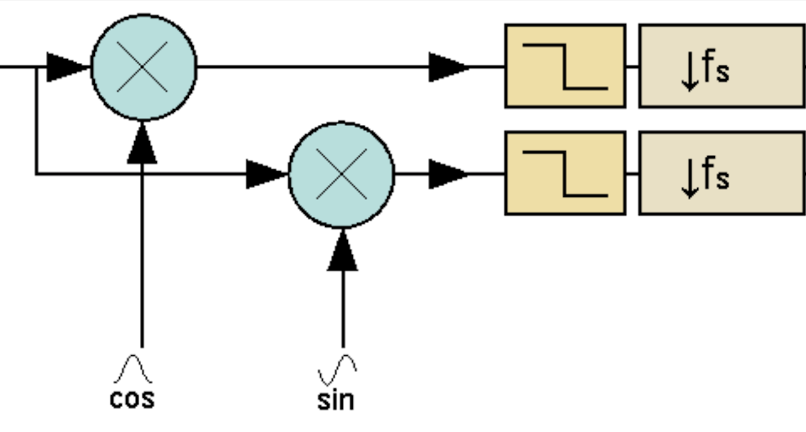

# 10. Přijímače – superhet a SDR

## superhet

## SDR

převedu signál na na niší frekvenci pomocí superhetu 

### DDC

**ant.**
-->
**BPF** 
--> 
**ADC** 
--> 
**DDC** 
-->
**CPU** 
--> 
**signal**

- BPF - filtr pro základní pásmo
- ADC - A/D převodník
- DDC - digitální směšovač (snižuje nosnou, posunuje ji o 90° a snižuje vzorkovací frekvenci)
- CPU - signáloví procesor

**DCC**  
 

### QSD

**ant.**
--> 
**BPF** 
--> 
**QSD** 
--> 
**ADC** 
--> 
**CPU** 
--> 
**signal**

- BPF - filtr pro základní pásmo
- QSD - analogoví směšovač (snižuje nosnou, posunuje ji o 90° a snižuje vzorkovací frekvenci)
- ADC - A/D převodník
- CPU - signáloví procesor
 
 
