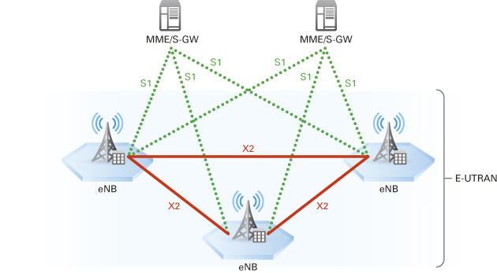

# 11. Architektura mobilních sítí (GSM, GPRS, LTE)
<!-- 
## Architektura mobilních sítí

### Zkratky
  - RAN (Radio Access Network) -
  - UE (User Equipmen) - uživatelský terminál (mobilní telefon)
  - BTS (Base transceiver station) - základnové stanice

### typy síť

#### trunková síť -->

#### Celulární síť
Celulární síť je metoda pokrytí oblasti signálem.
Oblast je rozdělena do podobně velkých částí, které se nazývají **buňky** (cell). Většinou mají tvar šestiúhelníků. V buňkách se opakují stejné frekvence, ale ne ve dvodvou sousedních. Svazkem se nazývají buňky s rozdílnou frekvencí. Svazky můžeme skládat libovolně vedle sebe, aniž by došlo k rušení.

 

<!-- ## síť s přepojováním okruhů (CS)
## síť s pepínání paketů (PS)

Vysvětlete, jak jsou tvořeny kmitočtové plánypro celulární sítě. Vkolika sektorech zpravidlapracuje jedna základnová stanice?
 -->

## G0
### AMR 
**Automatizovaný Městský Radiotelefon**

AMR byla celulární síť s přepojováními okruhy, analogovou signalizací a s analogovým přenosem hlasu.
AMR nepodporovala mobilitu, museli jste vědět, kde se uživatel nachází.

## G1
### NMT
**Nordic Mobile Telephone**

NMT byla celulární síť s přepojováními okruhy, digitální signalizací s analogovým přenosem hlasu.

Přístup byl vázán na konkrétní stanici, SIM neexistovala.

## G2
### GSM
**Global System for Mobile Communications**

GSM je celulární síť s přepojováními okruhy, digitální signalizací s digitální přenosem hlasu.

Uživatelská práva jsou vázány na SIM.

    G2      
    BTS (Base transceiver station) = základnové stanice
    BSC (Base Station Controller) = řídící stanice 
    UE (User Equipmen) = uživatelský terminál (mobilní telefon)
    MSC () = ústředna 

#### Přístupové metody
Přístupové metody v GSM jsou **FDAM** a **TDAM**.
FDAM jsou oddělené jednotlivé BTS ve svazku (celulární síť). TDAM jsou uděleny jednotlivé time sloty pro komunikaci s UE. Každá frekvence je rozděla na 8 time slotů, přičemž je jeden vyhrazen signalizaci.

 
**A - FDAM, B - TDMA, C - CDMA**

#### Pásma
      1. 900 MHz
      2. 1800 MHz

 

### G2.5
#### GSM s GPRS
GPRS přenášet data pomocí technologie přepínání paketů (PS). Hlas se stále přenáší pomocí přepojováním okruhů (CS). 

### G2.75
#### GSM s EGPRS
EGPRS došlo k zvýšení rychlosti přenosu dat. Díky změně modulace. 

## G3
### UMTS

**Universal Mobile Telecommunications System**

UMTS je celulární síť s přepojováními okruhy, digitální signalizací, digitálním přenosem hlasu a data s přepínáním paketů.

    G3      G2
    NodeB = BTS
    RNC   = BSC
    
#### Přístupové metody
Přístupové metody v UMTS jsou **FDAM** a **CDMA**.
FDAM jsou oddělené jednotlivé NodeB ve svazku (celulární síť). CDMA jsou oddělené jednotlivé UE.

#### Pásma
      1. 1,2 GHz
      
 

## G4
### LTE
**Long-Term Evolution**

LTE je celulární síť s přepínáním paketů, s digitální signalizací a s digitálním přenosem hlasu.

    G4      G2
    eNB  = BTS
    eNB  = BSC

 

## G5

mimo
