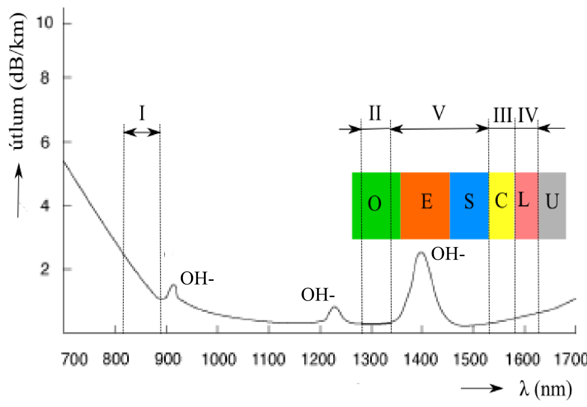

# 17. Zdroje světla pro telekomunikační systémy

Zdroje světla slouží k tomu, aby vyslaly signál po optickém vláknu.

## Parametry
- vlnová délka λ v optické komunikaci se používají tyto - 850 nm, 1310 nm a 1550 nm
- výkon P  0 dB = 1 mW

 

základní parametry používaného světla ( λ, P, spektrální charakteristika, .... ) a jejich zdůvodnění vzhledem k parametrům vláken 

## Zdroje světla
### LED 

### polovodičový Laser 

#### pásmový model laseru

emise, absorpce, stimulovaná emise, koherentní záření , energie fotonu 

čerpání, vyprázdněná oblast 

Fabri – Perotův rezonátor 

struktura LD (laserová dioda) 

Braggova mřížka 

dosažitelné parametry laserů 
