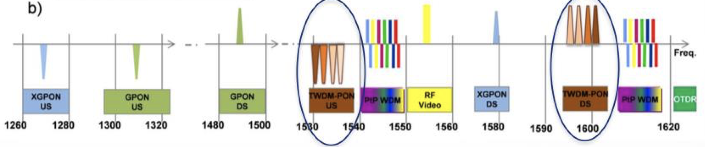

# 22. Přístupové optické sítě – druhy a principy funkce
Všechno kromě páteřní sítě 

## PON
pasive optical network

### P2P
komunikace bod bod  
používá se například pro firmy

      
    provider <------------> user

### P2MP
komunikace bod moc bodů  
požívá se pro 

                                    / <--> user
                  TDM              /  <--> user
    provider <------------> splitter
                                   \  <--> user
                                    \ <--> user
                                    
### GPON
ITU

 

### EPON
IEEE

                                      users
                               / <--> ONU/ONT
    provider                  /  <--> ONU/ONT
    OLT <------------> splitter
                              \  <--> ONU/ONT
                               \ <--> ONU/ONT
### Typy PON 
#### GPON
  - GPON - 2.5GB/1.252.5GB
  - NGPON1 - 10GB/2.5GB
  - NGPON2 - 40GB/10GB
  - XGS-EPON  - 10GB
  
#### EPON
  - 1G-EPON - 1GB
  - 10G-EPON - 10GB
  
  
# kubalik

co to je, k čemu to slouží 

názvosloví 

PON 

P2P, P2MP  

FTTx - FTTH, FTTB, FTT....  

GPON – protokoly, koexistence s jinými systémy, spojení mezi OLT a ONT  

EPON 

útlumový plán, třídy útlumu 
  
  
