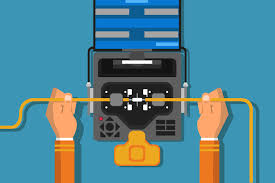
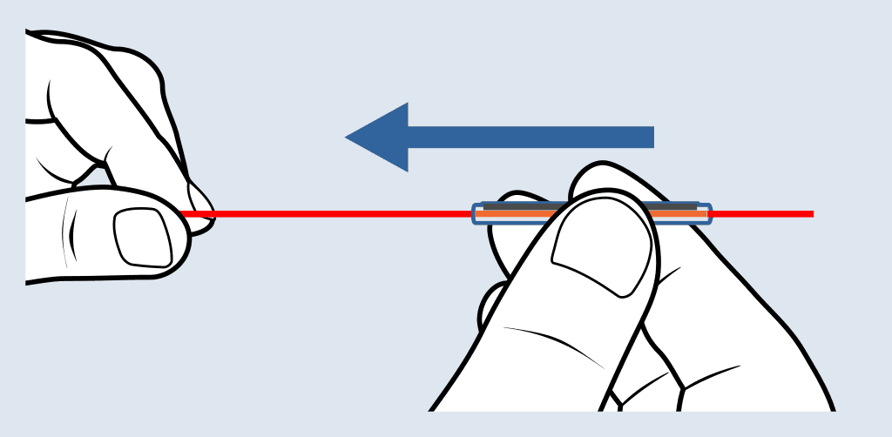
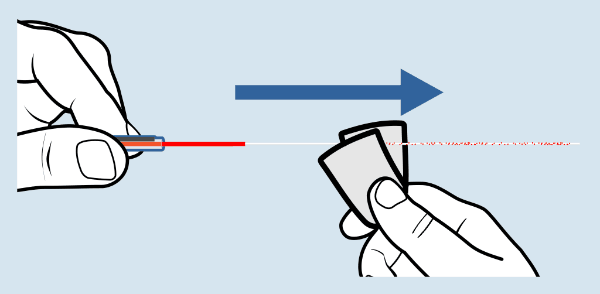
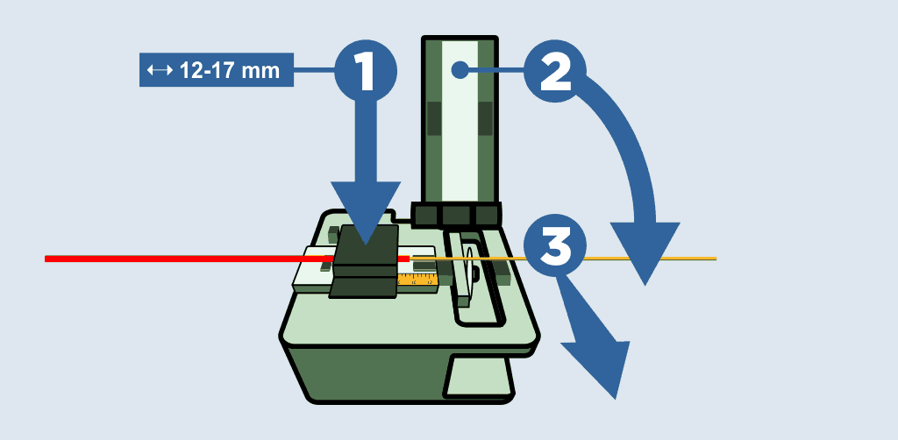
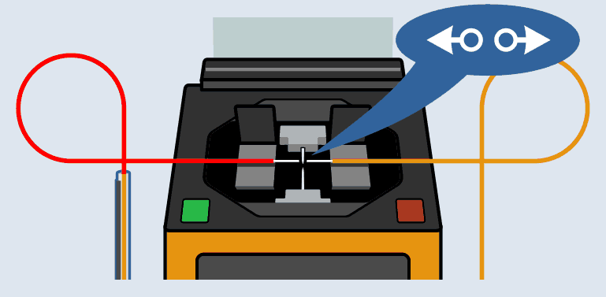
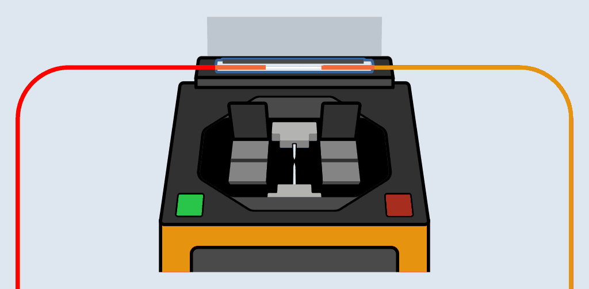
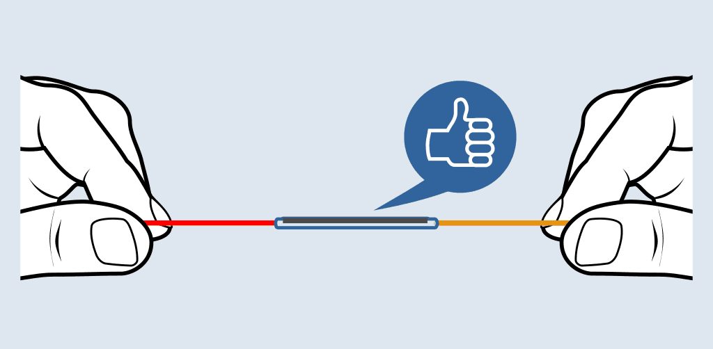
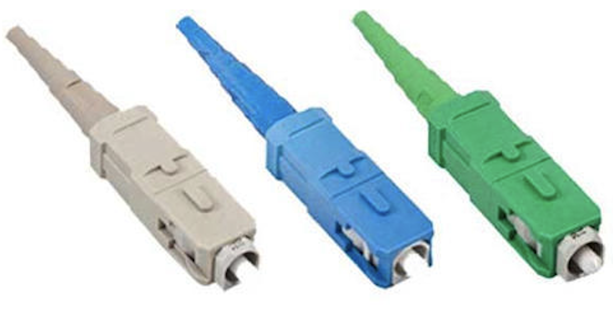
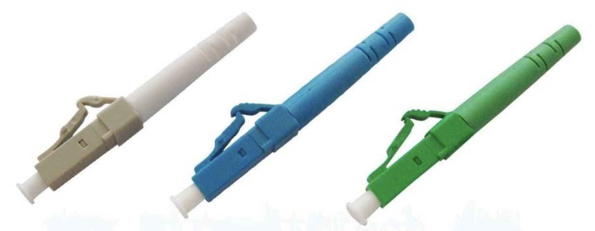
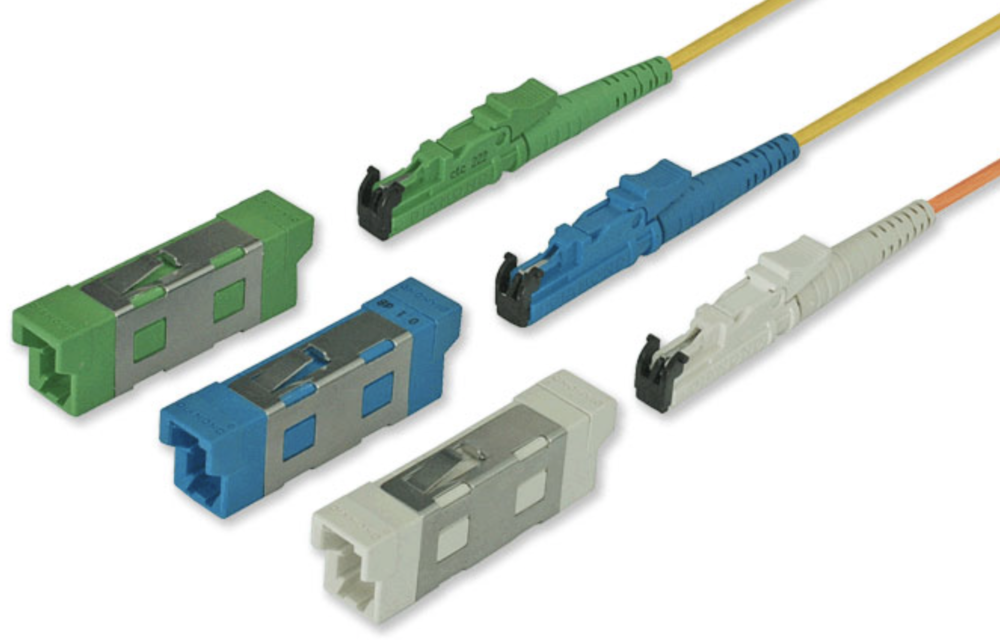

# 23. Komponenty pro optické přístupové sítě

## Vlákna

## Sváry
### Svár
 
 

### Svářečka
 
 

### Svařování

1. na vlákno nasadíme ochranu sváru.  
 

2. pomocí kleští sundáme primární ochranu.   
 

1. očistíme hadříkem namočeným do izopropil alkoholu.  
 

4. ulomíme konec vlákna na lámačce.  
 

5. vlákna upneme do svářečky, po zaklapnutí se automaticky svaří.  
 

1. na svár přemístíme ochranu a zapečeme.  
 

1. opatrně zatáhneme za čerstvý svár, pokud se neroztrhne je v pořádku.  
 

## Konektory

Konektor na spojování optických vláken tvoří keramická ferule, ve které je uchyceno skleněné vlákno. Ta je uchycena do plastového pouzdra, které zajištuje její rovnání vůči feruli na druhé straně.

### PC ferule

Konektor s označením **PC** je většinou **modrý**, ale může mít i jinou jakoukoli barvu.
Ferule je plochá.

 
 

### APC ferule
Konektor s označením **APC** je vždy **zelený** a takřka nikdy nemá jinou barvu.
Ferule je zkosená, aby deflektovala odražené světlo.  
**!!!**
**Zelený**
konektor se smí zapojovat jen do
**zeleného**
konektoru, jinak se zničí
**!!!**

 
 

### Typy konektorů
#### SC konektor
**SC** konektor je nepoužívanějším typem konektoru.  

 
 
 

#### LC konektor
**LC** konektor se většinou používá na zásuvných kartách v routrech a switčích.  

 
 
 

#### E2000 konektor   
**E2000** konektor se využívá na dálkových trasách díky jeho vysoké spolehlivosti.   
 

## Spojky

## Splitry

## Zesilovače

# Kubalik

OLT,  ONT  

vlákna  pro vnější vedení ,  pro vnitřní instalace 

kabely   - do kabelovodu , do země,   závěsné,   domovní - riser kabel  

kabelovody ,  trubičky,  mikrotrubičky,  zafukování  

konektory  - PC,APC, útlum, útlum odrazu , reflektogram  

splittery   - výpočet útlumu  

rozvaděče , cable management v rozvaděči  

účastnické zásuvky 

měření sítě pomocí OTDR   
