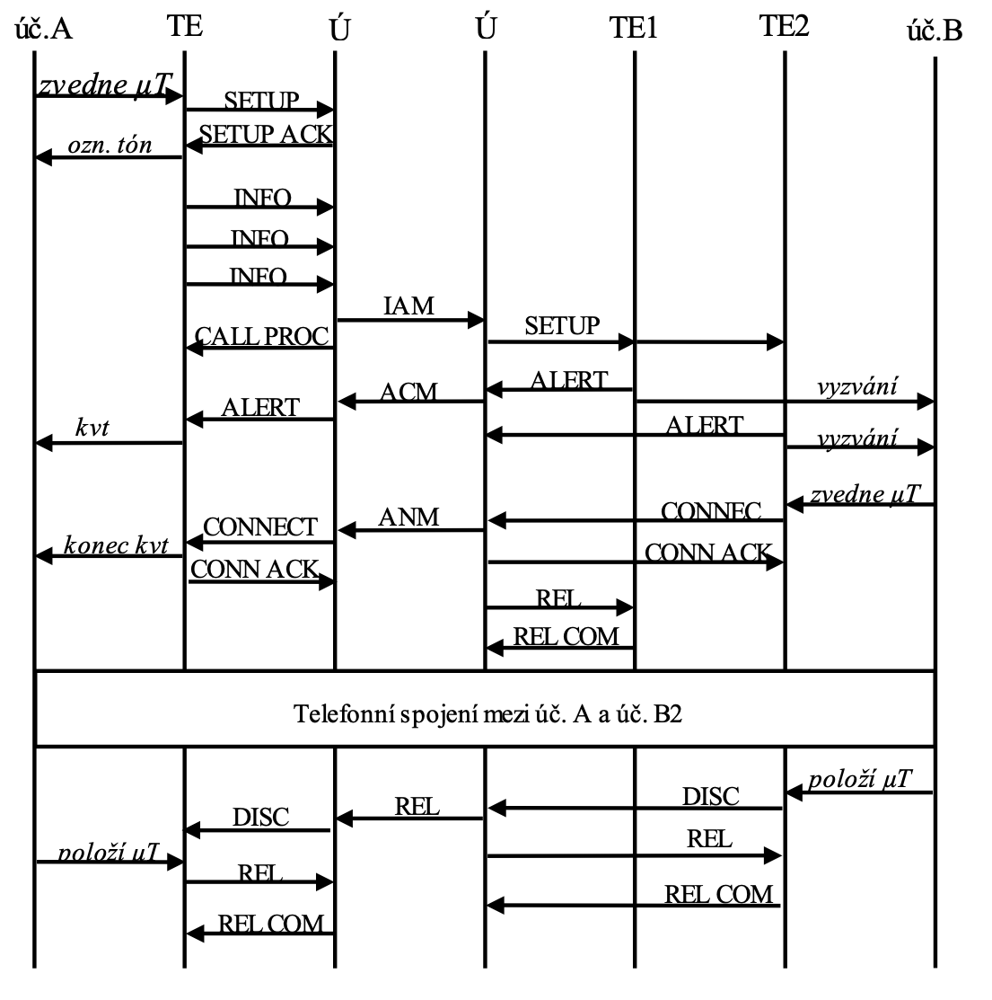

# 5. Signalizace ve spojovacích sítích

**Signalizace** (v telefonních sítích) je proces ke sestavení a ukončení telefonního hovoru

typy signalazice 
CAS - stejný kanál jako hovor
CCS - zvlášsní kanál

##stavi Signalizace

1. klid - klid
2. obsazení (vizvedneme telefon)
3. volba (natuáme číslo)
4. vizvánení
5. hovor - klid
6. ukončení hovoru

## Přenašeč tipu U
typ CAS
analogová Signalizace
### stavi 
klid - 48V, 0A
obsazení - stejnosměrný proud pokles V, teče 2OmA
volba - tónová nebo pulzní(pulzi 100 ms)
vyzvánění - střídavé napětí 50Hz/25Hz 75V
vyzvednutí - stejnosměrný proud pokles V, teče 2OmA 
ukončení hovoru - 48V, 0A

## Signalizace DSS1 
typ CAS 
digitální Signalizace
DSS1 používá se na ISDN rozhraní.
### ISDN
zdroj
http://www.elearn.vsb.cz/archivcd/FEI/ISDN/isdn_text.pdf
#### vrstvi 
1. fizická - AMI
2. linková - HDLC
3. Sítová - DSS1

### stavba packetu

Protocol discriminator

### stavi 
 

## Signalizace SS7
typ CCS
digitální Signalizace

### dělení sítí
- NAT 0 - provider
- NAT 1 - stát
- INAT 0 - mezistátní (evropa, usa)
- INAT 1 - mezikontinettální (země)

### typi ustředen
- SP
- STP 

zdroj
http://ozeas.sdb.cz/panska/3A/TS/vyuka/SS7/adoc.pub_signalizani-system-ss7.pdf

kubalík 

co to je, k čemu to slouží 

základní stavy signalizace ( klid, obsazení, volba, závěr, ......) 

přenašeč typu U 

signalizace DSS1 

signalizace SS7  

porovnání s modelem OSI 

popis signalizační sítě, úrovně, SP, STP  

MTP, TUP, ISUP, SCCP  vrstvi

popis průběhu signalizace při spojení účastníků   
